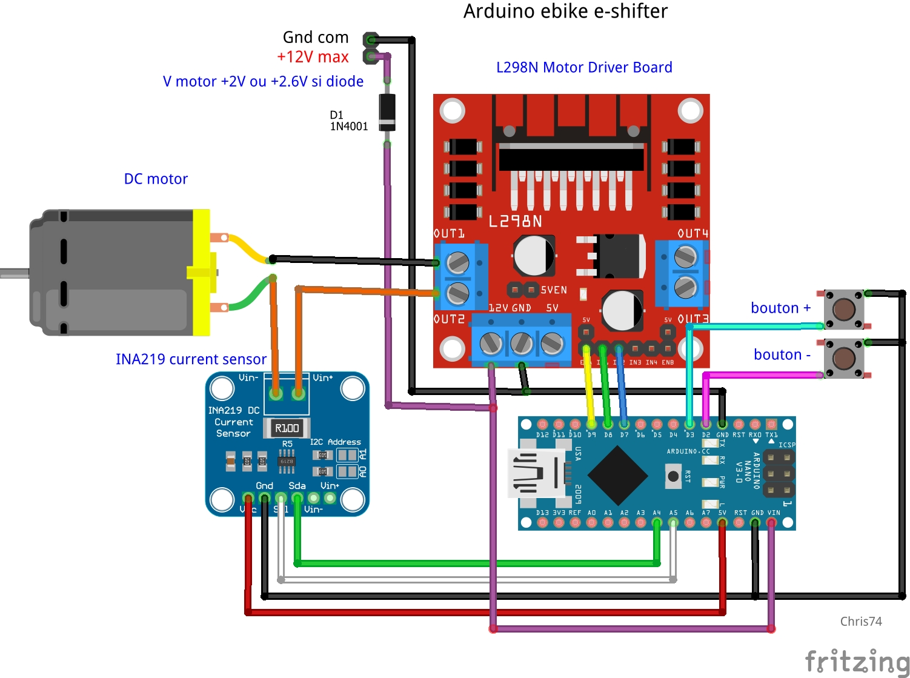
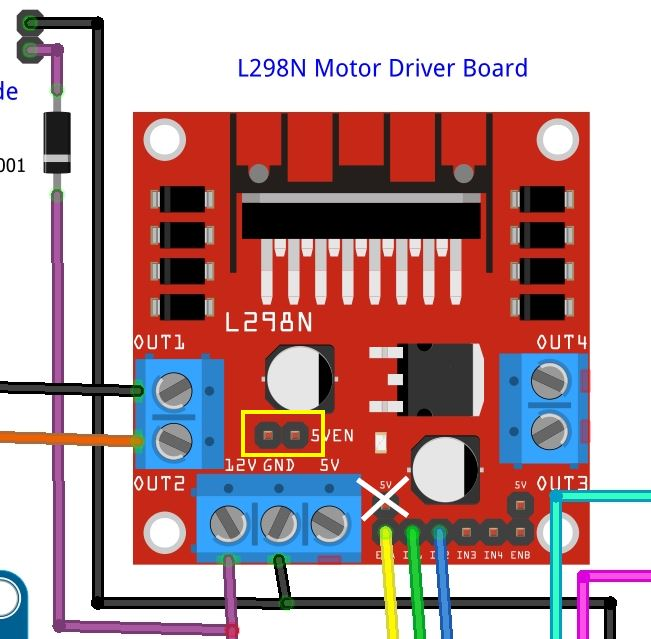
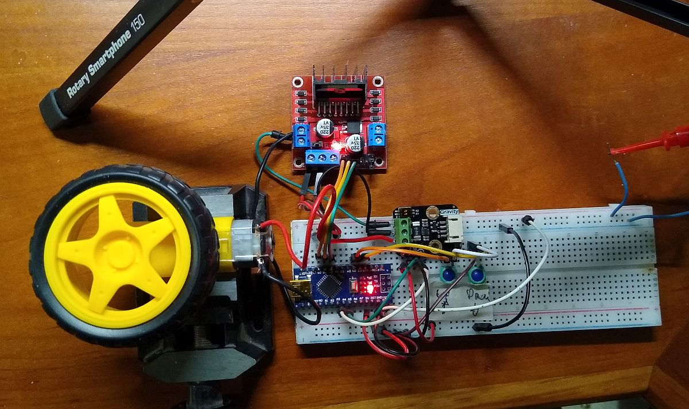
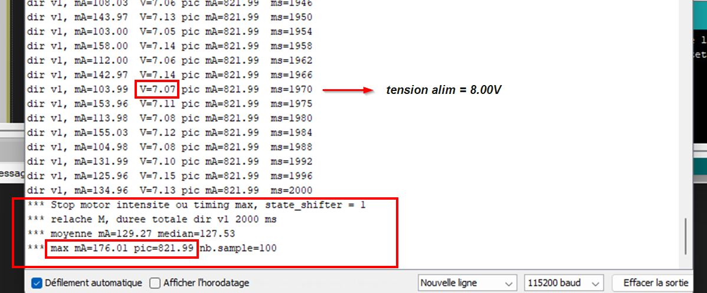

# ebike_arduino_eshifter
 eshifter for reconditioned VanMoof s5 ebike


Aide au membre de Cyclurba Kiki85 pour son reconditionnement d'un ebike VanMoof s5  
Aduino Nano/Uno, signal +5V, alim 9V.


**Discussion sur le forum Cyclurba**  - [Cyclurba](https://cyclurba.fr/forum/757849/programme-arduino-schifter.html?discussionID=31918)  
Site VanMoof - [VanMoof](https://www.vanmoof.com/fr-FR/our-rides/s5)

Librairies à installer, voir dossier "library_zip"  
Code de calibrage moteur et intensité, voir "arduino_eshifter_calibrage"  
Code d'utilisation voir "arduino_eshifter"  

---
#### VanMoof s5 eshifter
<p align="left">
  
</p>

#### Banc test : Arduino Uno/Nano + L298N + INA219
<p align="left">
  
</p>

#### Cavaliers circuit L298N
<p align="left">
  
</p>

#### Banc test
<p align="left">
  
</p>

#### Console Serial (code de calibrage)
<p align="left">
  
</p>
---

#### Utilisation
Régler les constantes en début de code selon vos essais, voir aussi le sujet sur le forum Cyclurba \
*Adjust constants at the beginning of code*

```
-- Setting ---

#define ADRESSE_INA 0x40     // adresse I2C INA219, generalement 0x40 (DFRobot=0x45) 
#define RSHUNT_INA 0.100     // valeur shunt, generalement R100 = 0.100 Ohm  (DFRobot=0.010) 
const int SPEED_MOTOR = 255; // speed moteur par defaut, 0 to 255 max (PWM 8bit)
const int MA_RUN = 360;      // (300) mA, conso en utilisation (sous ~6.5V au moteur)
const int MA_MARGE = 200;    // (150) mA, + marge de butee a pas depasser pour securite (stale = ? mA sous 8V)
const int MA_MAX = MA_RUN + MA_MARGE; 

// -- ces parametres influencent sur le controle intensite max moteur
const int SUP_PIC = 30;   // ms, filtrer les premieres ms du pic demarage moteur, env. 30-50=Ok ou 0 pour desactive
const int MIN_STAT = 20;  // mA, 20mA minimum pour etre affiche en direct et ajoute aux stats (laisser comme ca !)

const int TIMEOUT_1to3 = 2400;  // ms, temps de reference pour passer de v1 à v3 (butee basse a haute)
const int MARGE_HOME = 100;     // ms, petite marge a ajouter a TIMEOUT_1to3 pour etre sur de la position home v1 au boot
const int TIMEOUT_STEP = TIMEOUT_1to3/2; // ms, etape (1to2, 2to3, etc..), en principe TIMEOUT_1to3 / 2

const int DELAY_PUSH_BTN = 800; // ms, lorsqu'appui sur bouton et position atteinte (stop) = le delais d'attente avant reprise
// empeche relance moteur indesirable

const bool DOUBLE_CLIC_REINIT = true;  // reinit position home sur v1 si double-clic bouton down (descendre), true ou false

---
```


